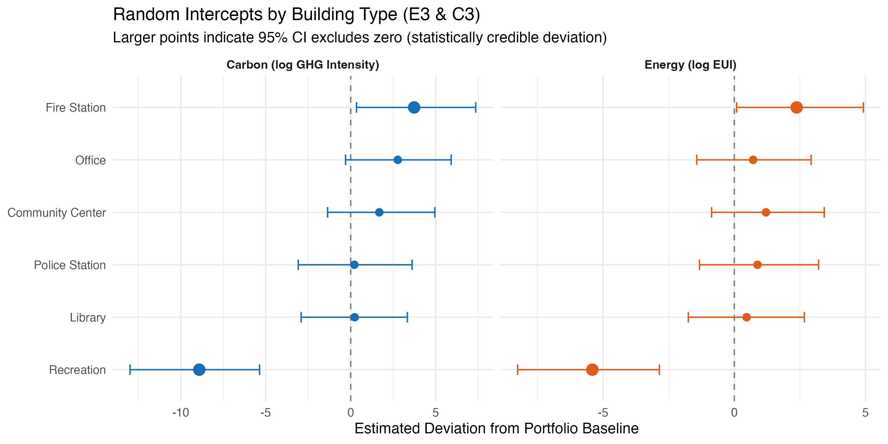
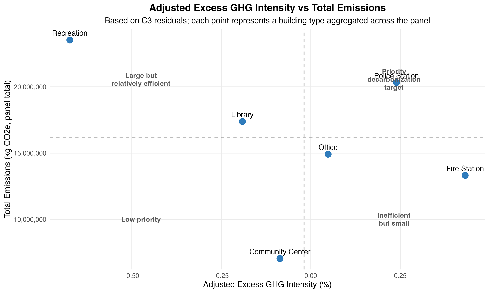

# Toronto Municipal Building Energy Efficiency Analysis, 2017–2024

Bayesian multilevel regression for energy and carbon performance benchmarking across Toronto's municipal building portfolio.

**University of Waterloo · MSE 718 · Winter 2026 · Team of 5**

---

## Skills Demonstrated

`Bayesian Hierarchical Modelling` · `R (brms, tidyverse, Stan)` · `LOO-CV Model Selection` · `Data Cleaning & ETL` · `Feature Engineering` · `Statistical Inference` · `ESG & Sustainability Analytics` · `Data Visualization` · `Research Translation`

---

## Research Question

Which building types remain above or below the portfolio baseline in energy use intensity (EUI) and GHG intensity after controlling for floor area, weekly operating hours, and year?

---

## Dataset

- **Source:** City of Toronto [Annual Energy Consumption dataset](https://open.toronto.ca/dataset/annual-energy-consumption/) (Open Data Toronto)
- **Panel:** 914 building-year observations · 6 building types · 2017–2024 (2021 excluded due to data gaps)
- **Building types:** Fire Station, Library, Office, Community Centre, Recreation, Police Station
- **Outcomes:** log(EUI) in ekWh/sqft · log(GHG intensity) in kg CO₂e/sqft

| Variable | N | Mean | SD |
|----------|---|------|----|
| Gross Floor Area (sqft) | 914 | 40,509 | 79,743 |
| Weekly Operating Hours | 914 | 111.6 | 37.6 |
| EUI (ekWh/sqft) | 914 | 33.0 | 19.5 |
| GHG Intensity (kg CO₂e/sqft) | 914 | 3.83 | 2.53 |

---

## Methods

### Model Specifications

Two outcome tracks (energy and carbon), each with three nested specifications:

```
M1 — Baseline (complete pooling):
  log(Y_i) = α + β₁·log(GFA_i) + β₂·log(Hours_i) + β₃·Year_scaled + ε_i

M2 — Random intercept:
  log(Y_i) = α_j[i] + β₁·log(GFA_i) + β₂·log(Hours_i) + β₃·Year_scaled + ε_i
  α_j ~ Normal(μ_α, σ_α)

M3 — Random intercept + slope (primary):
  log(Y_i) = α_j[i] + β₁_j[i]·log(GFA_i) + β₂·log(Hours_i) + β₃·Year_scaled + ε_i
  (α_j, β₁_j)ᵀ ~ MVNormal((μ_α, μ_β)ᵀ, Σ)
```

### Priors

| Parameter | Energy track | Carbon track |
|-----------|-------------|--------------|
| Intercept | Normal(3, 1) | Normal(1, 1) |
| Slopes | Normal(0, 1) | Normal(0, 1) |
| σ, SD | Exponential(1) | Exponential(1) |
| Correlation | LKJ(2) | LKJ(2) |

### Estimation

- HMC via `brms` / Stan · 4 chains · 2,000 iterations (1,000 warmup) · seed = 42
- adapt_delta = 0.99 (E3) / 0.995 (C3)
- All Rhat < 1.01; 1 divergent transition per primary model

### Model Selection (LOO-CV)

| Model | elpd_diff | SE |
|-------|-----------|-----|
| E3 (primary) | 0.0 | 0.0 |
| E2 | −26.7 | 12.4 |
| E1 | −62.8 | 11.2 |
| C3 (primary) | 0.0 | 0.0 |
| C2 | −44.5 | 14.6 |
| C1 | −79.9 | 14.0 |

E3/C3 adopted as primary models; E2/C2 retained as benchmarks.

---

## Key Results

**Figure 2. Random Intercepts by Building Type (E3/C3)**



**Energy track (E3):** No building type shows a credible deviation from the portfolio baseline after controlling for GFA, operating hours, and year. Raw EUI differences reflect structural factors, not genuine inefficiency.

**Carbon track (C3):** Fire Stations are the only type with a credibly above-baseline carbon deviation. Recreation, despite the highest raw EUI, falls below the carbon baseline after adjustment.

**Figure 3. ESG CapEx Allocation Matrix — Adjusted Excess GHG Intensity vs Total Emissions**



Integrating adjusted carbon intensity (x-axis) with total portfolio emissions (y-axis) to identify CapEx priorities:

- **Police Stations** (upper-right) → highest-priority: above-expected carbon intensity + high aggregate emissions
- **Fire Stations** (lower-right) → carbon-intensive but smaller in aggregate scale
- **Recreation** (upper-left) → large portfolio footprint but efficient after adjustment
- **Office** (left) → credibly low-carbon

**Residual analysis:** Pelmo Park and Wellesley Community Centre are persistent underperformers across multiple years on both tracks — facility-specific inefficiencies beyond type-level patterns.

**Core insight:** Carbon outcomes are driven by fuel mix, not total energy consumption. Electrification and fuel switching yield more decarbonisation impact than efficiency retrofits alone.

---

## My Contributions

**Technical & Analytical**
- Designed the dual-track analytical framework evaluating EUI and GHG intensity across 6 building types
- Developed GHG reconstruction methodology using annual Ontario grid emission factors (IESO) and Canada national gas emission standards
- Defined data preparation rules: building-type consolidation, outlier treatment, EUI/GHG metric construction
- Built and validated Bayesian hierarchical models in `brms` — prior specification, HMC estimation, posterior predictive checks, LOO-CV model selection

**Project Coordination**
- Coordinated task allocation and analytical milestones across 5 team members
- Aligned data definitions, modelling assumptions, and documentation standards throughout the project

**Research Framing**
- Formulated the core research question and ESG prioritisation framework
- Translated posterior model outputs into decarbonisation policy recommendations

---

## Repository Structure

```
├── data_clean_code/
│   └── toronto_data_cleaning_v2.r        # ETL: panel construction, GHG reconstruction, variable engineering
├── final_model_code/
│   ├── 718_Final_Model.R                 # Main analysis: models, diagnostics, LOO-CV, figures
├── cleaned_data/
│   └── Toronto_Master_Panel_Ready_v2.csv # Final panel (914 obs × 8 years)
├── output/                               # All figures (EUI boxplot, caterpillar, PPC, ESG matrix)
├── citation/                             # References and emission factor sources
├── MSE718_Project_Paper_Group4.pdf
└── README.md
```

---

## How to Reproduce

```r
# Step 1 — Build panel (~5 min)
source("data_clean_code/toronto_data_cleaning_v2.r")

# Step 2 — Fit models and generate figures (~30–60 min, HMC)
source("final_model_code/718_Final_Model.R")

# Cached .rds files (E1–E3, C1–C3) reload in seconds on re-run
```

**Requirements:** R ≥ 4.2 · `brms` · `tidyverse` · `bayesplot` · `loo` · `patchwork` · `readxl` · `writexl`

---

## References

- City of Toronto. Annual Energy Consumption dataset. [Open Data Toronto](https://open.toronto.ca/dataset/annual-energy-consumption/)
- City of Toronto. TransformTO Net Zero Strategy Action Plan 2026–2030.
- Environment and Climate Change Canada. (2024). National Inventory Report 1990–2022 (Table A13–7).

---

## Author

**Yangyang Dong** · MSc Candidate, University of Waterloo  
[LinkedIn](https://www.linkedin.com/in/sylvia-dong-6b3b61250/) · sylviadong.ca@gmail.com

